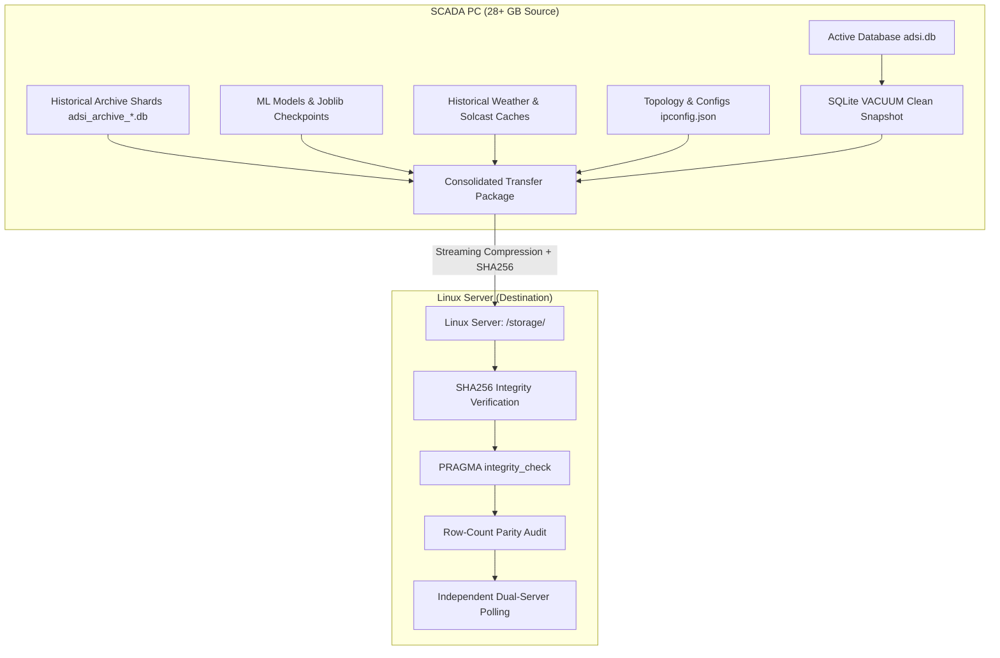

# Hardened 28+ GB Redundant Server Migration Plan
## SCADA PC (`100.81.240.80`) → Linux Server (`100.96.129.19`)

This plan defines the robust, zero-data-loss procedure to replicate the entire **28+ GB** historical dataset from the active SCADA PC to the Linux appliance to achieve 100% data parity and independent dual-server redundancy.

---

## 1. Environment & Storage Architecture

| Role | Hostname / OS | LAN IP | Tailscale IP | Storage Root | Free Disk Space |
| :--- | :--- | :--- | :--- | :--- | :--- |
| **Primary SCADA PC** (Source) | Windows SCADA | `192.168.1.3` | `100.81.240.80` | `C:\ProgramData\Inverter-Dashboard\` | ~28+ GB Active Data |
| **Redundant Linux Server** (Destination) | Ubuntu Appliance | `192.168.1.12` | `100.96.129.19` | `/home/adsi/Inverter-Dashboard/storage/` | **856 GB Available** (Confirmed) |
| **Workstation** (Orchestrator) | Windows Dev | — | Tailscale mesh | — | Multi-gigabit transfer relay |

---

## 2. Complete Asset Scope (28+ GB Dataset Breakdown)



### Exact Directories & Files to Replicate:
1. **Operational Database (`db/adsi.db`)**:
   - `inverter_5min_param` (all historical 5-minute telemetry intervals)
   - `alarms`, `alarm_episodes`, `inverter_stop_reasons`
   - `inverter_daily_stat`, `daily_report`
   - `forecast_dayahead`, `forecast_intraday_audit`
   - `inverter_asset_wear`, `igbt_thermal_daily`
   - `operator_audit`, `settings`
2. **Historical Partition Shards (`db/archives/*.db`, `db/adsi_archive_*.db`, `db/backups/`)**:
   - All monthly archived database shards containing multi-year electrical parameters.
3. **Machine Learning & AI Forecast Assets (`forecast/models/`, `forecast/training_data/`)**:
   - Scikit-learn trained pipelines (`.joblib`, `.pkl`), scaler weights, bias tables, and training histories.
4. **Weather & Irradiance History (`weather/history/`, `weather/cache/`, `forecast/solcast_cache/`)**:
   - Complete cached weather observations, Solcast irradiance history, and solar radiation baselines.
5. **Configuration & Topology Metadata (`db/ipconfig.json`, `autoreset.json`, `server-service-config.json`)**:
   - 27-inverter topology, per-node units, loss coefficients, auto-reset schedules, and background service flags.
6. **Calibration & Asset Baselines (`db/calibrations/`, `db/baselines/`)**:
   - Field calibration offsets and TrinPM20 scaling parameters.

---

## 3. Hardened Migration Phases

### Phase 1: Source Storage Discovery & Pre-Migration Manifest
1. Connect to SCADA PC (`100.81.240.80`) over Tailscale.
2. Traverse `C:\ProgramData\Inverter-Dashboard\` and inventory:
   - Total file count and exact aggregate size.
   - List of all archive databases, model artifacts, and weather cache directories.
3. Query active database row counts for the baseline integrity manifest:
   - Count of rows in `inverter_5min_param`, `alarms`, `daily_report`, `forecast_dayahead`, `inverter_stop_reasons`.
4. Generate `source_manifest.sha256` for all static files (archives, models, caches).

### Phase 2: Zero-Corruption Online SQLite Snapshot
> [!IMPORTANT]
> Because the SCADA PC is actively polling inverters 24/7, copying raw `adsi.db` while transactions are writing causes locked page errors and torn reads.
> We take a safe, live snapshot using SQLite's native backup mechanism:

1. Perform a WAL checkpoint and atomic online vacuum snapshot:
   ```sql
   PRAGMA wal_checkpoint(TRUNCATE);
   VACUUM INTO 'C:\ProgramData\Inverter-Dashboard\db\adsi_live_snapshot.db';
   ```
2. Run `PRAGMA integrity_check;` against `adsi_live_snapshot.db` on the SCADA PC to ensure the snapshot is 100% healthy before packaging.
3. Calculate `adsi_live_snapshot.db` SHA256 checksum.

### Phase 3: High-Throughput Compressed Transfer
1. Stream files using high-efficiency compression (`tar -czf` / `zstd`) partitioned into logical segments:
   - **Segment A (Configuration & Live Database)**: `ipconfig.json`, `autoreset.json`, `adsi_live_snapshot.db` (~1–3 GB compressed).
   - **Segment B (Machine Learning & Weather Caches)**: Models, joblibs, scalers, irradiance historical logs.
   - **Segment C (Historical Archive Shards)**: Multi-year partitioned monthly database shards (`archives/*.db`).
2. Stream directly into `/home/adsi/Inverter-Dashboard/storage/` on the Linux host (`100.96.129.19`).
3. Temporarily pause Linux poller & gateway services during deployment:
   ```bash
   echo sacups | sudo -S systemctl stop inverter-telemetry inverter-forecast inverter-gateway
   ```
4. Extract each segment directly into the corresponding storage paths:
   - `/home/adsi/Inverter-Dashboard/storage/db/adsi.db`
   - `/home/adsi/Inverter-Dashboard/storage/db/archives/`
   - `/home/adsi/Inverter-Dashboard/storage/forecast/`
   - `/home/adsi/Inverter-Dashboard/storage/weather/`

### Phase 4: Rigorous Integrity & Parity Validation
1. **SHA256 Checksum Verification**:
   - Compare SHA256 hashes of all extracted archive shards, models, and caches against `source_manifest.sha256`.
2. **Database Integrity & Foreign Key Audit**:
   ```sql
   PRAGMA integrity_check;
   PRAGMA foreign_key_check;
   ```
3. **Exact Row-Count Equality Validation**:
   - Execute side-by-side row-count verification across all core tables between the SCADA PC and Linux server. Zero missing rows allowed.
4. **ML Model Compatibility Probe**:
   - Test that Python 3.14 on Linux can load all transferred Scikit-Learn `.joblib` model artifacts without schema/version warnings.

### Phase 5: Service Start & Dual-Redundancy Verification
1. Fix all Linux file permissions (`chown -R adsi:adsi /home/adsi/Inverter-Dashboard/storage`).
2. Restart all three Linux background services:
   ```bash
   echo sacups | sudo -S systemctl start inverter-telemetry inverter-forecast inverter-gateway
   ```
3. Verify Dual-Server Concurrent Operation:
   - **SCADA PC (`100.81.240.80`)**: Verify it continues polling and logging without interruption.
   - **Linux Server (`100.96.129.19:3500`)**: Verify it polls in parallel, serves historical analytics curves across all past years/months, renders all historical alarms, and executes ML forecast schedules.

---

## 4. Verification Checkpoints

- [ ] **Pre-check**: Free disk space confirmed (`856 GB` available on Linux vs `28 GB` payload).
- [ ] **Snapshot**: `adsi_live_snapshot.db` generated via `VACUUM INTO` with zero lock contention.
- [ ] **Transfer**: All segments transferred with 100% SHA256 match.
- [ ] **Integrity**: `PRAGMA integrity_check` returns `ok` on all imported `.db` files.
- [ ] **Row parity**: Row counts on `inverter_5min_param` and `alarms` match.
- [ ] **UI Parity**: Historical Analytics, Daily Reports, Alarms, and Parameter logs on Linux match the SCADA PC identically.
